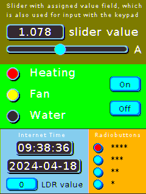
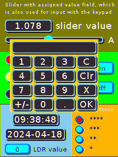

# Some graphical user interface components for the ESP32-2432S028R
While I was experimenting with the CYD, I designed some graphical components 
for the user interface, not least because using the *LVGL library* for simple 
user interfaces seemed a bit overkill to me. So far it's just a **panel 
container** that holds the other components, a **universal button**, a **toggle 
LED**, a **horizontal slider** and a **keypad** to enter numeric values. The button 
can display a value and be labeled. The toggle LED displays a selectable 
color when it is switched on. The slider can be linked to a value field. The 
color appearance of the components can be defined by specifying a color theme.

A user interface can consist of more than one panel. To do this, the user 
derives several user-defined panel classes from the UiPanel class, places 
the GUI components on them and implements button handlers that process the 
user input on the touchscreen.

| Screenshot showing 4 panels | Screenshot showing keypad |
|:----------:|:-------------------------:|
|  |  |

 The left image shows a user interface with 4 panels. The first contains 
 a slider with an associated value field. The value can be changed with 
 the slider or by direct input via a keypad within predefined limits. 
 The keypad appears when the value field assigned to the slider is touched. 
 This is shown in the right image.

 The second panel contains 3 LED buttons which change color when pushed and 2 
 on/off buttons to switch on or off the LEDs.

The third field shows the time and date that are retrieved from an NTP server. 
Another value field shows the value read from the built-in photo resistor.

The fourth panel has 4 LED buttons that behave like radio buttons. 
They control the brightness of the display in 4 levels.

