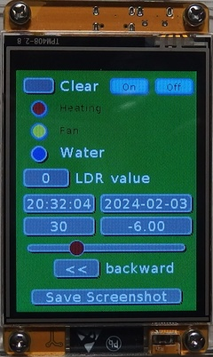

# Some graphical user interface components for the ESP32-2432S028R
While I was experimenting with the CYD, I designed some graphical components for the user interface. So far it's just a universal button and a toggle LED. The button can display a value and be labelled. The toggle LED shows a selectable colour when switched on and calls a callback every time the status changes. The colour appearance can be set by specifying a colour scheme. 



In the picture you can see that the On and Off buttons and the first two LEDs use the *blueTheme* colour scheme, while the other components are displayed in the *defaultTheme* scheme. 
The *SaveScreenshot* button should save the screen content to the SD card. 👉 Unfortunately, only an empty white area is saved. Why this is the case is still a mystery to me.


## Usage
The code block below shows how the user interface of the example was created.
```
//                Text       Button  Border  Shadow  Font
uiTheme blueTheme(TFT_BLACK, 0x07df, 0x03df, 0x01ca, &fonts::DejaVu12);
uiTheme defaultTheme;

// Create the UI components
uiButton btnClear(lcd, 10,10,40,20, "", "Clear");
uiButton btnOn(lcd, 125,10,50,20,blueTheme, "On");
uiButton btnOff(lcd, 185,10,50,20,blueTheme, "Off");
uiButton adc(lcd, 10, 130, 60, 24, "", "LDR value");
uiButton theTime(lcd, 10, 170, 94, 24);
uiButton theDate(lcd, 112, 170, 122, 24);
uiButton btnReverse(lcd, 50, 250, 60, 24, ">>", "forward");
uiButton btnScreenshot(lcd, 20, 290, 200, 20, "Save Screenshot");
uiLED    led1(lcd, 30, 50, 10,  TFT_RED, toggleHeating, blueTheme, "Heating");
uiLED    led2(lcd, 30, 80, 10,  TFT_YELLOW, toggleFan, blueTheme, "Fan");
uiLED    led3(lcd, 30, 110, 10, TFT_BLUE, toggleWater, "Water");
```